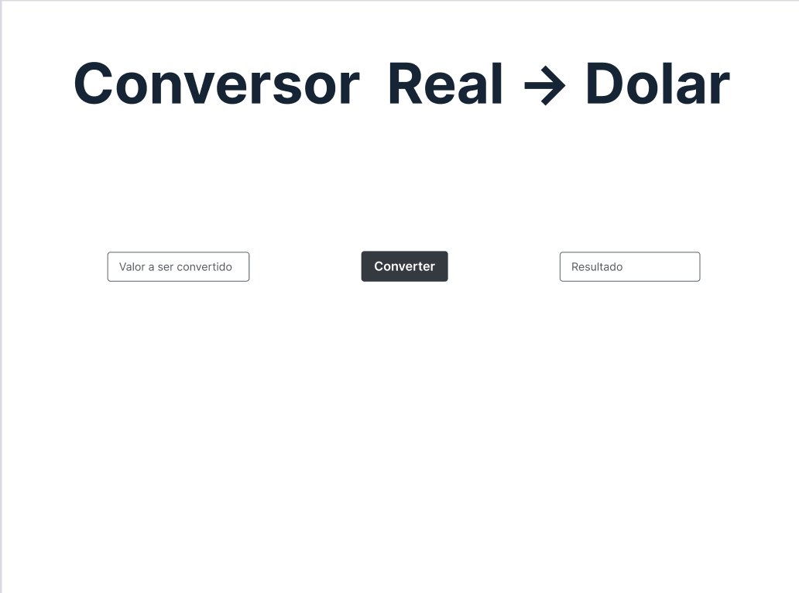
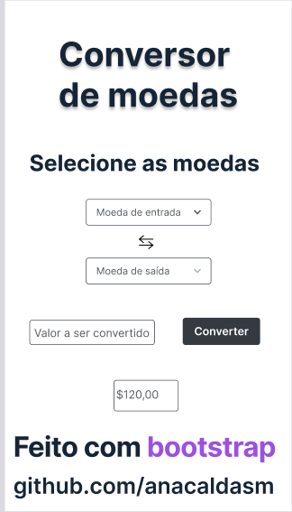

# Projeto Conversor

Neste projeto você irá desenvolver um conversor de moedas utilizando bootstrap. O projeto foi pensado em partes com nível crescente de dificultade, é recomendado seguir a ordem de tópicos descrita nesta documentação.

## Conhecimentos Utilizados

- HTML, CSS e Javascript
- Bootstrap
- Comunicação com API's públicas

## Guia de desenvolvimento

### 1 - Setup básico

Para este projeto você irá precisar apenas de um browser atualizado (sugerimos: [Chrome](https://www.google.com/intl/pt-BR/chrome/)!) e um editor de código de sua preferência. Já no seu **fork** clonado, utilize os arquivos base na pasta para sua implementação (`index.html`, `estilos.css`, `conversor.js`).

Certifique-se de que consegue ver a aplicação rodando em seu browser, para isto execute o file `index.html` com o **Chrome**.

### 2 - Primeiros componentes visuais

Agora que você já testou o setup básico do projeto seu objetivo é desenvolver um comversor que, a partir da entrada do usuário converte o valor inserido de
Real (BRL) -> Dólar(USD).

Como primeiro passo, vamos fazer um conversor simples de Real para Dólar, para isto vamos no basear no valor do Dólar como sendo fixo em `$ 5.68`. logo, se o
usuário entrar com o valor de `R$ 11.36` o programa deverá demonstrar na `<div>` de resultado o valor de `$ 2`.

Para te ajudar montamos a seguinte interface padrão:



Siga-a como uma guia, porém não é necessário que o design dos elementos esteja perfeitamente igual ao da foto. Considere apenas ter os memos "componentes" (Um header com texto informativo, um insert para o valor escolhido pelo usuário, um botão de conversão e uma `div` para resposta)

Neste passo, ainda não é necessário escrever código `Javascript`, apenas que tenha um desing pronto como o demonstrado acima.

### 3 - Fazendo um conversor estático

A partir das indicações acima vamos utilizar o visual já feito para agora escrever o código javascript que irá realizar o cálculo e a demonstração do resultado
em nossa página. Para isto você deve criar uma função `calculaConversao()` que será chamada no `onClick` do botão `Converter`.

Quando o usuário clicar em `Converter` alguns cenários podem ocorrer:

- O usuário entrou com um valor em **reais** no `insert`, com isto a função divide o valor por nossa cotação fixa: `$ 5.68` e altera a div de resposta demonstrando o valor.
- O usuário entrou com um valor, clicou em `Converter` e viu a resposta, ainda com o mesmo valor, clicou novamente no botão, neste caso o valor demonstrado não deve se alterar.
- O usuário clicou no botão `Converter` sem inserir nenhum valor, neste caso o programa não deve fazer nada.

### 4 - Bootstrap

Agora com o programa já tendo uma certa funcionalidade mínima vamos utilizar o [Bootstrap](https://getbootstrap.com/docs/5.0/getting-started/introduction/) para
estilizar nossa aplicação, para isto vamos utilizar alguns componentes básicos do framework:

- [Buttons](https://getbootstrap.com/docs/5.0/components/buttons/).
- [Dropdown](https://getbootstrap.com/docs/5.0/components/dropdowns/).
- [Icons](https://getbootstrap.com/docs/5.0/extend/icons/).
- [Tipografia](https://getbootstrap.com/docs/5.0/content/typography/).

O design a seguir apresenta uma demonstração de como deve ficar a página:


Perceba que o design ainda se assemelha muito ao exercício anterior com algumas variações:

- Agora é possível selecionar um par de moedas para realizar a conversão.
- O uso de componentes bootstrap.

Nesta tarefa, adapte seu site para utilizar o Bootstrap e adicione os novos componentes visuais necesários.

### Convertendo múltiplas moedas

É hora de atualizar nosso `Javascript` e permitir a conversão entre múltiplas moedas, para isto vamos ter 3 cotações fixas:

- Dólar
- Euro
- Real

Para simpificar vamos deixar aqui o objeto que possui todas as relações de conversão (valores devem ser mantidos fixos):

```javascript
const cotacoes = {
    "USD": {
        "BRL": 5.6856501497,
        "EUR": 0.8313934154,
    },
    "BRL": {
        "EUR": 0.146226622,
        "USD": 0.175881381,
    },
    "EUR": {
        "BRL": 6.8387,
        "USD": 1.2028,
    }
}
```

Logo se o usuário selecionar a conversão de Real -> Dolar o nosso valor de conversão será `cotacoes['BRL']['USD'] == 0.175881381`. Assim é possível calcular o valor de uma determinada quantia de dinheiro de quaquer moeda para outra!

Seu código agora deverá também avaliar quais são as moedas selecionadas pelo usuário no momento que ele clicar em `Converter` e com isso, variar a taxa de conversão antes de exibir o resultado final na página.

### 6 - Tornando o conversor dinâmico

Um problema claro com a aplicação que fizemos até o momento é o valor constante das cotações uma vez que sabemos que cotações de moedas variam bastante com o tempo. Logo rapidamente nosso site perde sua funcionalidade e passa a ser muito custoso de ser mantido (com 3 cotações talvez seja até mais fácil, agora imagine 50 moedas!). Para resolver este problema vamos utilizar um serviço externo, que vai nos informar em tempo real qual a cotação entre duas moedas.

Utilizando a [Exchange Rates API](https://exchangeratesapi.io/), uma API onde podemos gratuitamente verificar cotações, vamos pegar os valores atualizados antes de calcular o resultado a ser demonstrado. Veja no exemplo a seguir como pegar os dados:

#### Utilizando a API

Para a acessar a API vamos utilizar a **URL** do site e parametrizála para nossas necessidades

```bash
# Endereço base da API
curl "https://api.exchangeratesapi.io/latest"

# ?               -> Início da passagem de parametros
# symbols=USD,BRL -> Lista de moedas a serem retornadas na comparação
# &               -> Operador lógico AND ou &&
# base=EUR        -> Moeda base de cálculo

# Obter taxa de conversão para dólar e reais a partir do euro
curl "https://api.exchangeratesapi.io/latest?symbols=USD,BRL&base=EUR"
```

Caso você tenha um terminal com o programa `curl` instalado, pode copiar e executar os comandos abaixo:

```bash

curl "https://api.exchangeratesapi.io/latest?symbols=USD&base=EUR"

# Response: {"rates":{"EUR":0.146226622},"base":"BRL","date":"2021-03-02"}
```

Caso contrário, para ver o resultado da chamada acima, você pode ver o resultado diretamente no browser, basta digitar como url `https://api.exchangeratesapi.io/latest?symbols=USD&base=EUR`. Aproveite para testar a API, trocando os valores e observando o retorno, o site documenta diversas formas de utiliza-lá.

Contextualizando, no javascript podemos utilizar o [fetch](https://developer.mozilla.org/pt-BR/docs/Web/API/Fetch_API/Using_Fetch) para receber estes valores (assim como fizemos acima) porém em nossa aplicação! Nosso objetivo agora é substituir em nossa aplicação o objeto `cotacoes` e trocá-lo por chamadas de API, por exemplo, o objeto:

```javascript
const cotacaoBRL = {
    "BRL": {
        "EUR": 0.146226622,
        "USD": 0.175881381,
    },
}
```

é compatível com o resultado de:

```javascript
const pegaTaxaDeConversao = async () => {
    const cotacaoBRL = await fetch("https://api.exchangeratesapi.io/latest?symbols=USD,EUR&base=BRL")
}
```

> É sugerido para este exercício que se utilize `async/await` bem como `arrow functions` para sua resolução. É bem provável que você vá encontrar exemplos utilizando outras sintaxes, caso isto traga dúvidas entre em contato pelos canais da PodCodar no discord.
> [fetch com async await](https://stackoverflow.com/questions/65256495/how-can-i-save-data-from-fetch-function-using-async-await)

Uma vez vinculado a API oque você pode fazer para complexificar e expandir seu projeto?

- Extender a lista de conversão
- Fornecer mais informações relacionadas a cotações
- Adaptar a interface com novas funcionalidades (setas trocam a ordem das moedas selecionadas, demonstrar mais de um valor ao mesmo tempo, etc...)

### 7 - Responsividade

Nesta nova rodada vamos adaptar nosso `CSS` e deixar a aplicação que desenvolvemos responsiva (que atende e se adapta a diversos tamanhos de Visor).
Para isto, utilize os padrões de `flex-box` ou `grid` para criar regras onde, caso seu site seja aberto em um celular sua visualização fique da seguinte
forma:



> O [css-tricks guides](https://css-tricks.com/guides/) tem ótimas referências para estes padrões!

### 6 Publicando no Github Pages

Agora com a aplicação finalizada, vamos publicá-la para que outras pessoas possam utilizar seu conversor!

Crie uma cópia de sua resolução aqui e a coloque em um novo repositório público no Github, para mais informações siga [este tutorial](https://docs.github.com/pt/github/working-with-github-pages/creating-a-github-pages-site).
